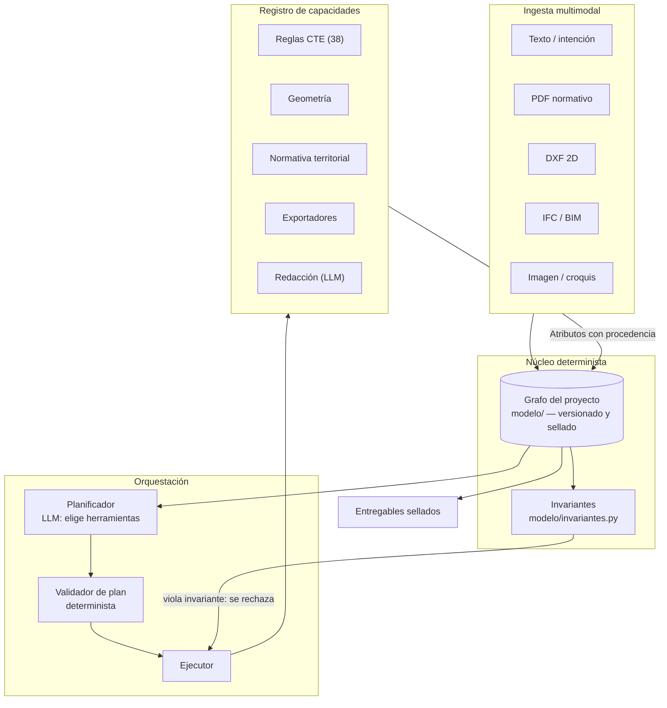
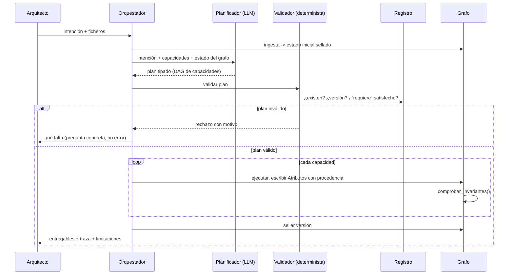

# ADR — El "Cerebro Arquitecto": diagnóstico, arquitectura y secuencia

**Fecha:** 2026-08-18 · **Estado:** propuesta, no aprobada · **Autor:** análisis técnico sobre el repositorio en `1015275`

**Qué es este documento.** La respuesta al encargo de evaluar la reorientación hacia un "Cerebro Arquitecto", contrastada contra el código real, no contra la idea del código. Cada afirmación sobre el estado del repositorio se ha verificado leyendo el fichero citado; donde no he podido verificar algo, lo digo en §G en vez de rellenarlo.

**Postura.** La que exige `CLAUDE.md`: CTO, no ejecutor de tickets. Hay partes de esta visión que considero un error estratégico y lo digo con nombre y apellidos en §E. También hay una parte que es claramente correcta y está peor financiada de lo que merece.

---

## 0. Resumen ejecutivo — seis conclusiones

**1. La visión ya está escrita en este repositorio, y no es de hoy.** `docs/brain/` contiene 22 documentos (`VIRTUAL_ARCHITECT.md`, `INFERENCE_ENGINE.md`, `KNOWLEDGE_GRAPH.md`, `EVIDENCE_MODEL.md`, `UNCERTAINTY_MODEL.md`…) más cuatro en la raíz (`BRAIN_ARCHITECTURE.md`, `REASONING_ENGINE_SPEC.md`, `DECISION_ENGINE.md`, `CHAIN_REASONING.md`). `BRAIN_ARCHITECTURE.md` abre literalmente con *"diseñar la arquitectura de conocimiento del 'cerebro' de ArchMuse"*. Lo genuinamente nuevo del encargo **no es el cerebro**: es el *contrato de entrega* (lenguaje natural dentro, trabajo terminado fuera) y la *orquestación agéntica*. Nombrarlo con precisión importa, porque cambia qué hay que financiar: no un diseño desde cero, sino un conector entre un diseño ya hecho y una capa de ejecución que no existe.

**2. El sustrato correcto ya está construido, pero no soporta carga.** `modelo/` (2.194 líneas, 11 ficheros) es un grafo de proyecto con identidad, geometría referenciada, invariantes y **procedencia epistémica tipada** (`observado | declarado | derivado | supuesto` × `KNOWN | ESTIMATED | UNKNOWN | NO_APLICABLE`). Es exactamente el sustrato que un sistema agéntico necesita para no contaminar un entregable profesional con una alucinación. Y hoy **no participa en ningún cálculo**: `app.py:494` lo construye y lo persiste, con un comentario que lo dice explícitamente (`app.py:483-485`). El producto sigue corriendo sobre la lista plana de `List[Room]`.

**3. El techo real no es arquitectónico, son tres huecos concretos.** (a) `modelo/` no es portante; (b) el corpus normativo está **vacío** — `normativa/api.py` lo declara: *"El corpus sigue vacío… transcribir normativa exige validación de un arquitecto colegiado"*; (c) no existe **importación** de IFC ni ingesta de imágenes. La evolución incremental es viable para el orquestador; la promesa de portada de la visión ("adjunta IFC/BIM, imágenes") depende de trabajo que hoy es cero.

**4. La verificación normativa no está limitada por ingeniería.** El motor de resolución territorial de `normativa/` (4.752 líneas, 8 pasos, esquemas JSON, geografía española completa) está implementado y probado. Lo que falta es el contenido, y el contenido necesita un colegiado. Ninguna arquitectura agéntica mueve esa aguja. Es el cuello de botella más caro del proyecto y no es un problema de software.

**5. La visión entra en conflicto directo con el North Star aprobado.** `NORTH_STAR_2031.md` (horizonte 24 meses) dice: *"dejar de ser 'una herramienta a la que se sube un archivo'"*. `DESTROY_ARCHMUSE.md` §1a identifica "exportar, subir el archivo, esperar y leer un informe aparte" como la debilidad estructural nº1. **La nueva visión dobla la apuesta exactamente ahí.** Esto no es un detalle de matiz: son respuestas opuestas a la misma pregunta estratégica. Desarrollado en §E.1.

**6. "El usuario no ve la complejidad" contradice el argumento de venta ya elegido.** `MOAT_ANALYSIS.md` Pilar 2 sitúa la transparencia — *"te decimos exactamente qué hemos comprobado y qué no"* — como el argumento comercial **principal** y el más difícil de replicar. Un cerebro invisible que devuelve trabajo terminado es la caja negra que un arquitecto que se juega su firma no acepta. Desarrollado en §E.2.

---

## A. Diagnóstico de la base de código

### A.1 Escala real

Medido sobre el árbol en `1015275`, excluyendo `venv/`:

| Zona | Ficheros | Líneas | Estado |
|---|---:|---:|---|
| `analyzer/` | 50 | 22.007 | Producción, es el producto |
| `static/` | 13 | 18.332 | SPA vanilla, sin build |
| `tests/` | 109 | 24.593 | 357 passed / 3 xfailed, ~14 min |
| `docs/` | 100 | 27.127 | Diseño y PRD; más volumen que `analyzer/` |
| `normativa/` | 29 | 4.752 | Motor completo, **corpus vacío** |
| `app.py` | 1 | 2.690 | 40 endpoints en un fichero |
| `modelo/` | 11 | 2.194 | Construido, **no portante** |
| `extraccion/` + `ingesta/` | 21 | 2.384 | Pipeline normativo LLM, aislado |
| `experimentos/` | 10 | 1.201 | Desechable por diseño |
| `JarvisApp.py` | 1 | 989 | Gemini, ajeno al producto |

Dos lecturas que no son obvias:

- **`docs/` es mayor que `analyzer/`.** Este proyecto ha diseñado más de lo que ha construido. Para el encargo actual eso es una **ventaja**: el diseño del cerebro ya está pagado. Pero también es la señal de riesgo a vigilar — la tentación de responder a este documento con otros doce documentos.
- **La suite es del tamaño del producto** (24.593 vs 22.007 líneas). Es lo que hace que un refactor profundo sea posible sin volar el producto, y es el activo que hace *creíble* cualquier plan de esta magnitud.

### A.2 Auditoría de reutilización, módulo por módulo

#### Reutilizable al 100% — el núcleo del cerebro ya existe

| Módulo | Por qué se conserva íntegro |
|---|---|
| **`modelo/`** (2.194) | El sustrato. `Atributo` cruza estado × origen y **no admite un valor sin procedencia**. `Grafo` tiene versiones selladas (`VersionSellada`), `invariantes.py` valida el grafo, `serializacion.py` da forma canónica + sha256, `identidad.py` empareja entidades entre versiones. Esto es, literalmente, la infraestructura de auditoría que un sistema agéntico necesita — y ya está escrita y probada. |
| **`analyzer/hechos.py`** (147) | El vocabulario de incertidumbre del que `Atributo` es la extensión. Frontera vigilada por `tests/test_modelo_fronteras.py`. |
| **`normativa/`** (4.752) | Motor de resolución territorial puro, sin estado, que no importa nada de `analyzer/` (hay un test que falla si se invierte la dependencia). Es la pieza mejor diseñada del repositorio y la peor aprovechada. |
| **Las 38 funciones `evaluate_*`** de `evaluator.py` | Cada una es pura, tipada, con su `*Result` propio (36 dataclases). **Ya tienen forma de herramienta.** Este es el hallazgo más útil de toda la auditoría: la "tool-ificación" del motor de reglas es envolver, no reescribir. |
| Geometría: `parser.py`, `escala.py`, `plan_svg.py`, `circulation.py`, `spatial_quality.py` | Es la "cicatriz" que `DESTROY_ARCHMUSE.md` §3 desprecia y que `MOAT_ANALYSIS.md` §7 llama joya de la corona. Ambos tienen razón a la vez: es trabajo compensatorio *y* es difícil de replicar. Se conserva porque el mercado español pequeño sigue en DXF. |
| Exportadores: `ifc_export.py`, `dxf_export.py`, `dossier_pdf.py`, `cuadro_superficies_export.py` | Ya producen ficheros de entrega. Son el embrión del contrato "trabajo terminado". |

#### Necesita refactorización — y el refactor es el proyecto

| Módulo | Problema concreto | Qué hacer |
|---|---|---|
| **`app.py`** (2.690, 40 rutas) | Controlador obeso: orquesta, valida, serializa y decide dentro de cada handler. | Los **40 endpoints ya son el registro de capacidades de facto**. El refactor no es "partir app.py en blueprints" — es extraer de cada handler la capacidad pura y dejar la ruta HTTP como uno de dos consumidores (el otro es el orquestador). |
| **`evaluator.classify_problems`** (382 líneas, `evaluator.py:2321-2703`) | Un `if/elif` gigante que mapea cada `*Result` a un `IssueReport`. Es el **nudo de acoplamiento**: cada regla nueva lo toca. | Invertir: que cada regla declare su propia traducción a hallazgo. Es el cambio que convierte "38 funciones evaluables" en "38 herramientas registrables". |
| **`api_serializer.py`** (525) | Contrato de la API acoplado a la forma interna. | Debe pasar a serializar el **grafo**, no la lista de `Room`. Es el paso que hace portante a `modelo/`. |
| **`static/app.js`** (5.523) | Monolito vanilla sin build. `index.html` ya bajó a 265 líneas, así que la modularización empezó. | Fuera del camino crítico de este ADR. No lo toquéis todavía. |

#### Aislar o descartar

| Módulo | Veredicto |
|---|---|
| `main.py` + `analyzer/reporter.py` (628) | CLI heredada, **un solo usuario interno**. `DESTROY_ARCHMUSE.md` §2 la señala como inversión desperdiciada. Ya lleva banner de "esto no es el producto" desde la tarea 4. Congelar: ni recibe capacidades nuevas ni se borra todavía. |
| `JarvisApp.py` (989) + `requirements-jarvis.txt` | Asistente Gemini sin relación con ArchMuse. Sacar a su propio repositorio. |
| `experimentos/` (1.201) | Desechable por diseño y así está documentado. Correcto como está. |
| Visor 3D (`viewer-*.js`, ~5.900) | `MOAT_ANALYSIS.md` §6 y `DESTROY_ARCHMUSE.md` §2 coinciden: es lo más caro y **no está conectado a los hallazgos**. No lo amplíes; conéctalo o congélalo. |
| `three.js` desde `unpkg.com` (`index.html:255`) | Dependencia de producción sobre una CDN de terceros. Riesgo de disponibilidad y de cadena de suministro en un producto que aspira a entregar trabajo profesional. |

### A.3 Los tres techos reales

**Techo 1 — `modelo/` no es portante.** El comentario de `app.py:483-485` es explícito: *"El resultado no participa en ningún cálculo de este endpoint… sólo se guarda al final"*. Se construye best-effort dentro de un `try/except Exception` que lo anula en silencio si falla (`app.py:494-496`). La decisión fue correcta para E2 — persistir el modelo era la mejora, dejar de analizar no lo era. Pero significa que hoy hay **dos representaciones del proyecto** y la que manda es la pobre.

**Techo 2 — el corpus normativo está vacío.** No es una opinión mía; `normativa/api.py` lo declara en su propio docstring. El motor resuelve correctamente que, para cualquier proyecto, falta **toda** la normativa exigible — y lo dice con nombre y apellidos en vez de devolver una lista corta que se leería como completa. Mientras tanto, `evaluator.py` aplica 38 reglas con umbrales escritos a mano en Python. **Hay dos sistemas normativos paralelos y el declarativo no gobierna nada**: en producción, `normativa/` solo se usa para derivar zona climática y densidad urbana (`analyzer/cte_zonas.py:28-30`).

**Techo 3 — la ingesta multimodal es un tercio de lo prometido.**

| Modalidad | Estado real |
|---|---|
| Texto | ✅ `analyzer/interview/` (2.545 líneas), motor determinista + `claude_interprete.py` aislado |
| PDF normativo | ✅ `extraccion/segmentador_pdf.py`, `pliego_extractor.py`, `ingesta/fuentes/{boe,codigotecnico}.py` |
| DXF 2D | ✅ `parser.py` + lectura/escritura verificada byte a byte |
| **IFC / BIM** | ❌ **Solo exportación**, y deliberadamente delgada: `IfcSpace` con contorno 2D, sin muros, forjados ni huecos (`ifc_export.py`, decisión del PRD de 2026-08-17). **No hay importador.** |
| **Imágenes / croquis** | ❌ **Cero.** No hay `PIL`, ni `base64`, ni ninguna llamada multimodal en todo el repositorio. |

### A.4 Veredicto de viabilidad

**Sí, incrementalmente — pero no en el orden que sugiere el encargo.**

No hay techo arquitectónico que obligue a un replanteamiento estructural. Hay algo mejor: un sustrato correcto ya construido y sin usar. La ruta incremental existe y es corta, porque el trabajo difícil (diseñar la epistemología del modelo) ya está hecho.

Lo que **no** es incremental es la promesa de portada. "Adjunta un IFC y recibe trabajo terminado" no es una evolución de nada: hoy es cero código. Y es, además, el sitio donde `DESTROY_ARCHMUSE.md` §3 sitúa el ataque más serio contra el producto.

Un dato que impone honestidad sobre el ritmo: **la corrección del bug de tipología/zona climática todavía no tiene un golden que la proteja** (Fase 2 del plan de fases del `REFACTOR_MASTERPLAN.md`). Antes de construir un cerebro que orqueste cientos de capacidades, conviene que las 38 que ya existen estén protegidas contra la regresión que ya ocurrió una vez.

---

## B. Arquitectura del Cerebro Arquitecto

### B.1 Principio rector: núcleo determinista, periferia lingüística

Un único principio del que se derivan todas las decisiones siguientes:

> **El LLM elige y redacta. El LLM nunca calcula un número que llegue a un entregable.**

No es purismo. Es la consecuencia directa de `MOAT_ANALYSIS.md` §1: lo que se vende es defensa profesional. Un número inventado dentro de un IFC que Revit trata como dato real no es un bug de producto, es un problema de responsabilidad civil.

El repositorio **ya tiene el mecanismo para hacer cumplir esto**, y no hace falta inventarlo: `modelo/atributo.py` obliga a que todo valor lleve `origen`. La regla se vuelve verificable por un test, no por disciplina:

> Ningún `Atributo` producido por una herramienta LLM puede llevar `origen=OBSERVADO` ni `origen=DERIVADO`. Solo `SUPUESTO` (hipótesis del sistema) o `DECLARADO` (si el arquitecto lo confirmó). Un invariante en `modelo/invariantes.py` lo comprueba en cada sellado.

Eso convierte la política anti-alucinación en una propiedad estructural del modelo, que es donde `hechos.py` y `atributo.py` ya la habían puesto.

### B.2 El grafo como pizarra compartida



Decisiones que este diagrama fija:

1. **Una sola representación del proyecto.** El grafo es la única verdad. Hoy hay dos (grafo + `List[Room]`) y manda la pobre. Esto se invierte.
2. **Las herramientas no se hablan entre sí.** Escriben en el grafo y leen del grafo. Es lo que evita el grafo de dependencias N×N que convierte un sistema de cientos de capacidades en espagueti a los dos años.
3. **Los invariantes son un portero, no un informe.** Un plan cuyo resultado viola un invariante se rechaza antes de sellarse. `comprobar_invariantes()` y `exigir_invariantes()` ya existen.
4. **El planificador no ejecuta.** Produce un plan tipado que un validador determinista acepta o rechaza. Un LLM que ejecuta directamente es un LLM sin auditoría.

### B.3 Registro de capacidades: el manifiesto

El riesgo a diez años no es que haya cientos de herramientas. Es que nadie sepa cuál es segura de llamar, cuál cuesta dinero, cuál escribe en disco y cuál depende de un dato que el proyecto no tiene. La respuesta es que **cada capacidad se declare, y que la declaración sea ejecutable**.

```python
@dataclass(frozen=True)
class Capacidad:
    id: str                      # "cte.evacuacion.distancia"  — namespace por dominio
    version: str                 # semver; un plan viejo se puede reproducir
    dominio: str                 # los dominios de BRAIN_ARCHITECTURE.md Parte 2

    naturaleza: str              # "determinista" | "llm" | "io"
    # determinista: misma entrada -> misma salida, siempre. Golden-testeable.
    # llm:          no reproducible. NUNCA puede emitir OBSERVADO/DERIVADO.
    # io:           toca disco, red o dinero. Requiere confirmación explícita.

    requiere: Tuple[str, ...]    # rutas del grafo que DEBEN existir y ser KNOWN
    produce: Tuple[str, ...]     # rutas del grafo que escribe
    origen_emitido: str          # OBSERVADO | DECLARADO | DERIVADO | SUPUESTO

    efectos: Tuple[str, ...]     # () = puro. "escribe_fichero", "llama_api", "gasta_tokens"
    coste_estimado_ms: int
    referencia_normativa: Optional[str]   # "CTE DB-SI 3 §4" o None. Sin inventar.
    limitaciones: Tuple[str, ...]         # lo que esta capacidad NO verifica
```

Cinco propiedades que este esquema compra, y por qué cada una:

- **`requiere` hace imposible el "dato plausible".** Si una capacidad necesita la altura de planta y el grafo no la tiene como `KNOWN`, no se ejecuta: se pregunta o se declara `UNKNOWN` con motivo. Es el mecanismo que impide reproducir el bug que `DESTROY_ARCHMUSE.md` §5.1 identifica como el motivo nº1 de abandono.
- **`naturaleza` particiona la suite de tests.** Las `determinista` entran en el golden (`tests/fixtures/golden/`, G1–G9 ya existen). Las `llm` se prueban por contrato, nunca por valor exacto.
- **`limitaciones` alimenta directamente el Pilar 2 de `MOAT_ANALYSIS.md`.** La lista de "qué no hemos comprobado" deja de ser un párrafo redactado a mano y pasa a **derivarse** de las capacidades que se ejecutaron. Ese es el argumento de venta principal, generado por construcción.
- **`referencia_normativa`** es el enganche natural con `normativa/` cuando el corpus deje de estar vacío.
- **`version`** permite reproducir un análisis de hace dos años tal y como se emitió — que es lo que exige defender una firma ante un litigio.

**Aislamiento.** Un paquete por dominio, con la misma regla de dependencia unidireccional que `normativa/` ya se autoimpone y que un test vigila. Sugerencia de estructura:

```
capacidades/
  __init__.py          registro: descubrimiento por manifiesto, no por import manual
  cte/                 envuelve las 38 evaluate_* de evaluator.py
  geometria/           parser, escala, plan_svg
  territorial/         normativa/ + sitio.py
  documentos/          ifc_export, dxf_export, dossier_pdf, cuadro_superficies_export
  redaccion/           las únicas con naturaleza="llm"
```

El registro se puebla por descubrimiento de manifiestos. Añadir una capacidad no toca ningún fichero central — que es la única forma conocida de llegar a cientos sin un `if/elif` de 382 líneas, exactamente el que hoy es `classify_problems`.

### B.4 El orquestador: planificar, validar, ejecutar



Cuatro decisiones justificadas:

- **Plan tipado, no cadena de llamadas.** Un DAG de `(capacidad_id, versión, argumentos)` es inspeccionable, cacheable, reproducible y **mostrable al usuario antes de ejecutar**. Un agente que llama herramientas en bucle no es ninguna de esas cuatro cosas.
- **Validar antes de ejecutar.** Un plan que pide una capacidad inexistente, o cuyo `requiere` no se cumple, se rechaza **sin gastar un token ni tocar un fichero**. Y el rechazo es información útil: es exactamente la pregunta que el sistema debe hacerle al arquitecto. `analyzer/interview/motor.py` ya tiene esa lógica ("pregunta solo lo que falta, nunca dos veces lo mismo") y es reutilizable como generador de preguntas.
- **Un ciclo de replanificación, no N.** Si tras ejecutar aparece un hueco, se replanifica **una vez** y se para. Los agentes que replanifican sin límite son los que se comen el presupuesto y la latencia sin converger.
- **Sellado al final.** `sellado_de(grafo)` produce el sha256 canónico. Ese sello **es** el "pasaporte de cumplimiento" que `NORTH_STAR_2031.md` §2 describe. Ya está implementado.

### B.5 Pipeline unificado de ingesta

La coherencia se consigue con un contrato único, no con un parser único:

> Todo ingestor produce `List[Atributo]` con `procedencia` (fichero, página/capa/entidad, timestamp) y `origen` fijado por su naturaleza. **Ningún ingestor decide nada.**

| Entrada | Módulo | Origen que emite | Trabajo pendiente |
|---|---|---|---|
| DXF | `parser.py` | `OBSERVADO` | Ninguno; ya existe |
| PDF normativo | `extraccion/` | `OBSERVADO` (texto) → `DERIVADO` (regla) | Ninguno; ya existe |
| Texto/intención | `interview/` | `DECLARADO` | Conectar al grafo |
| **IFC** | — | `OBSERVADO` | **Nuevo.** Ver abajo |
| **Imagen** | — | `SUPUESTO`, siempre | **Nuevo.** Ver abajo |

Dos decisiones que quiero dejar clavadas:

**IFC entra por donde el DXF sufre.** Un IFC trae `IfcSpace` como objeto de primera clase, con límites y adyacencia reales. Es decir: el importador de IFC **no necesita** la reconstrucción heurística que `parser.py` hace a base de fuerza bruta. Ambos desembocan en el mismo grafo. Esto neutraliza parcialmente el ataque central de `DESTROY_ARCHMUSE.md` §3 — el foso deja de estar atado al DXF sin tirar el trabajo ya hecho para quien siga en DXF.

**Una imagen nunca produce un hecho observado.** Un croquis fotografiado no mide nada. Todo lo que salga de una imagen entra como `SUPUESTO`, con estado `ESTIMATED`, y **debe** ser confirmado por el arquitecto para ascender a `DECLARADO`. Sin esta regla, la ingesta de imágenes es el vector de alucinación más peligroso del sistema entero: parece medición y no lo es.

### B.6 Trazabilidad

Todo lo necesario ya está construido: `Procedencia` en cada nodo (`modelo/nodos.py`), `Atributo` con origen y confianza, `VersionSellada` + `sellado_de()`, `Identidades.emparejar()` para comparar versiones. Lo que falta es **usarlo**: hoy se sella un grafo que no gobierna nada.

---

## C. El MVP de alto impacto

### C.1 Criterios de elección

Un MVP que demuestre la tesis "trabajo profesional terminado" debe cumplir cuatro cosas a la vez: (1) devolver un **fichero de trabajo**, no un informe; (2) **no depender del corpus vacío**; (3) apoyarse en código ya probado contra un plano real de cliente; (4) ejercer el ciclo agéntico completo de punta a punta.

### C.2 Recomendación: **el cuadro de superficies, entregado como DXF modificado**

**Por qué esta y no la memoria justificativa.** La memoria justificativa es el hueco que `DESTROY_ARCHMUSE.md` §4 identifica como *no resuelto por nadie* — es el premio gordo. Pero exige citar articulado literal, y el corpus está vacío. Construirla ahora obliga a que un LLM cite normativa de memoria, que es precisamente el fallo que no se perdona dos veces. **Va la segunda, no la primera.**

El cuadro de superficies, en cambio:

- Ya existe y está probado: `cuadro_superficies.py` (891) + `cuadro_superficies_export.py` (259), con 4 endpoints en `app.py`.
- **Ya escribe un DXF de verdad**, y `tests/test_cuadro_superficies_export.py` verifica con sha256 que el original queda **byte a byte idéntico**, que la copia reabre sin errores de `audit()`, y que ninguna celda bloqueada lleva una cifra — siempre "N/D", nunca un número inventado. Ese test es la prueba de que la disciplina de "no fabricar un dato" ya está operativa sobre un entregable real.
- Es trabajo que un arquitecto hace a mano, es tedioso, y es verificable de un vistazo.

**Entradas:** un DXF con el cuadro sin rellenar, más una intención en lenguaje natural (*"rellena el cuadro de superficies de la VT1 y dime qué no has podido calcular"*). Opcionalmente, el PDF del pliego, que `pliego_extractor.py` ya sabe leer.

**Salidas — todas ficheros, ninguna una pantalla:**

| Entregable | Origen | Ya existe |
|---|---|---|
| `proyecto_ArchMuse_relleno.dxf` | `cuadro_superficies_export.py` | ✅ |
| Cuadro en PDF | `pdf_report.py` / `dossier_pdf.py` | ✅ |
| **Acta de procedencia** — qué celda salió de dónde, qué quedó `UNKNOWN` y por qué | derivado del grafo + manifiestos | ❌ nuevo, y es el corazón del MVP |
| Sello de versión (sha256) | `sellado_de()` | ✅ |

**Qué demuestra.** Que el sistema orquesta capacidades reales, produce un fichero que el arquitecto abre en AutoCAD, y **es capaz de decir con precisión qué no sabe** — que es el argumento de venta del Pilar 2 convertido en producto, no en eslogan.

**Coste estimado:** el 70% del trabajo es cablear, no construir. El 30% nuevo es el orquestador mínimo (registro + plan + validador) y el acta de procedencia.

---

## D. Riesgos técnicos y mitigación

| # | Riesgo | Mitigación concreta, apoyada en lo que ya existe |
|---|---|---|
| **R1** | **Alucinación normativa.** Un LLM cita un artículo del CTE que no dice lo que dice. | Invariante estructural (§B.1): las capacidades `llm` no pueden emitir `OBSERVADO`/`DERIVADO`. `referencia_normativa` solo puede apuntar al corpus; **si el corpus está vacío, no hay cita** — que es lo que `normativa/api.py` ya hace hoy correctamente. Test de frontera al estilo de `test_modelo_fronteras.py`. |
| **R2** | **Corrupción topológica** al escribir DXF/IFC. | Ya resuelto y probado: sha256 del original antes/después, `ezdxf.audit()` sobre la copia, comprobación de que no aparece ningún otro fichero. **Elevar ese patrón a requisito de todo exportador**, no solo del cuadro de superficies. Nunca escribir sobre el original. |
| **R3** | **Latencia.** Un plan de 40 capacidades no cabe en una petición HTTP. | `coste_estimado_ms` en el manifiesto permite presupuestar el plan **antes** de ejecutarlo. Las `determinista` se cachean por (versión, sello del grafo de entrada) — reproducibles por definición. Streaming de estado por capacidad, no una barra de progreso falsa. |
| **R4** | **Trazabilidad legal.** Un año después hay que defender por qué se dijo lo que se dijo. | El sello + la versión de cada capacidad reproducen el análisis exacto. Es la razón de que `version` esté en el manifiesto. |
| **R5** | **Regresión silenciosa** al crecer a cientos de capacidades. | La suite ya está en 357/3 con `xfail(strict=True)`: el día que se arregla un defecto conocido, pytest fuerza a quitar la marca. Extender a: golden obligatorio para toda capacidad `determinista`. **Antes de nada, cerrar la Fase 2** — la corrección de tipología/zona sigue sin golden que la proteja. |
| **R6** | **No hay autenticación.** SQLite local en `~/.archmuse`, 4 tablas, cero usuarios, cero roles. | Bloqueante para todo lo que `NORTH_STAR_2031.md` sitúa a 12 meses (multiusuario, roles, historial). No lo arregla el cerebro; hay que planificarlo aparte. |
| **R7** | **`three.js` desde `unpkg.com`** en producción (`index.html:255`). | Vendorizar. Un producto que entrega trabajo profesional no puede caerse porque una CDN tenga un mal día. |
| **R8** | **Coste por ejecución.** Cientos de capacidades y replanificación libre queman presupuesto sin converger. | Un único ciclo de replanificación (§B.4). `efectos` marca lo que gasta dinero y exige confirmación. |

---

## E. Crítica constructiva

### E.1 El conflicto que hay que resolver antes de escribir código

La visión y el North Star aprobado responden lo **contrario** a la misma pregunta:

| | Dice |
|---|---|
| `NORTH_STAR_2031.md`, 24 meses | *"dejar de ser 'una herramienta a la que se sube un archivo' y convertirse en una capa nativa de cumplimiento en tiempo real dentro del flujo BIM"* |
| `DESTROY_ARCHMUSE.md` §1a | *"ArchMuse obliga a exportar a DXF, subir el archivo, esperar y leer un informe aparte… Esto no es una mejora de UX, es un cambio de categoría"* |
| La nueva visión | *"el usuario exprese una intención… o adjunte archivos de trabajo… y reciba trabajo profesional terminado"* |

**Adjuntar un archivo y esperar es exactamente el flujo que los dos documentos aprobados identifican como la debilidad estructural nº1.** La nueva visión lo mantiene y lo hace más lento, porque una orquestación agéntica tarda más que una petición.

No digo que la visión sea incorrecta. Digo que **una de las dos está obsoleta y hay que decir cuál, por escrito**. Las tres salidas posibles:

1. **El cerebro sustituye al North Star.** Legítimo, pero entonces `NORTH_STAR_2031.md` deja de ser la brújula y hay que reescribirlo. No puede haber dos nortes.
2. **El cerebro es el motor; BIM es la superficie.** *Esta es mi recomendación.* El cerebro se construye ahora y se expone primero por web (donde ya hay producto), pero el registro de capacidades se diseña desde el día uno para ser invocable **desde dentro de Revit/ArchiCAD**. Las dos visiones dejan de competir: una es el qué, la otra el dónde. Es la única lectura que no tira trabajo.
3. **Aparcar el cerebro** y ejecutar el North Star. Coherente, pero desaprovecha `docs/brain/` y `modelo/`, que es donde está el diferencial no replicable.

### E.2 "El usuario no ve la complejidad" es el error más caro de la visión

`MOAT_ANALYSIS.md` Pilar 2 sitúa la transparencia como el argumento comercial **principal**. `NORTH_STAR_2031.md` §5 mantiene que la firma y la responsabilidad civil siguen siendo del arquitecto. `DESTROY_ARCHMUSE.md` §5.1 dice que el motivo nº1 de abandono es descubrir un resultado mal calculado — *"no vuelve a confiar en el resto de hallazgos aunque el 95% restante sea correcto"*.

Un arquitecto que firma **no puede** entregar trabajo que no sabe cómo se produjo. La opacidad no es una virtud de UX aquí; es un impedimento de venta.

**La corrección es pequeña y cambia el producto entero:** lo invisible debe ser el *esfuerzo*, no el *razonamiento*. El arquitecto no ve las 200 llamadas — pero sí ve, en una página, qué se comprobó, con qué dato, de dónde salió ese dato y qué quedó sin comprobar. Eso es el acta de procedencia del §C.2. **Convertid "el cerebro invisible" en "el trabajo hecho, con el porqué a un clic"**: mismo ahorro de esfuerzo, sin pedirle al usuario que confíe a ciegas.

### E.3 "Cientos de capacidades" es una métrica de vanidad

`DESTROY_ARCHMUSE.md` §2 lo anticipa: un competidor con 50M€ *no competiría por tener más reglas*, sino por tener 10-15 con fiabilidad auditada. Y ArchMuse ya tiene 38 reglas cuyo corpus normativo de respaldo está vacío. **Añadir capacidades antes de auditar las que hay amplifica el riesgo R1, no el valor.** El número correcto de capacidades para el MVP está entre 8 y 12.

### E.4 Producir "trabajo terminado" cambia la postura legal

Hoy ArchMuse asesora. Un sistema que entrega una memoria técnica y un IFC "listos para entrega" se acerca a *autoría*. `NORTH_STAR_2031.md` §5 es tajante: *"la responsabilidad civil sigue siendo del arquitecto colegiado"*. Cuanto más terminado el entregable, más difícil sostener esa frontera. Necesita una decisión explícita — probablemente que todo entregable salga marcado como **borrador para revisión de un colegiado**, con el acta de procedencia adjunta.

### E.5 Tres añadidos que harían el producto excepcional

**1. El acta de procedencia como producto, no como anexo.** Ningún competidor la tiene y ArchMuse **ya tiene la infraestructura** (`Procedencia`, `Atributo`, sellado). Un documento que dice, celda por celda, de qué entidad de qué fichero salió cada número — eso es lo que un arquitecto enseña a su aseguradora. Es el Pilar 2 hecho artefacto.

**2. Cerrar el círculo generar → evaluar → corregir → reevaluar.** `MOAT_ANALYSIS.md` §9 lo llama la ventaja no explotada que *cambia la categoría del negocio*, y el inversor del documento coincide. Un sistema agéntico es la forma natural de cerrarlo: el planificador ya sabe qué capacidad detectó el problema y cuál puede corregirlo. **Esto sí es un uso de agentes que ninguna arquitectura no-agéntica hace bien**, y es el mejor argumento a favor de todo este encargo.

**3. Poner el corpus normativo en el camino crítico.** Es el activo compuesto (`MOAT_ANALYSIS.md` §5: cobertura mantenida del mosaico normativo español). Su motor está construido y esperando. **El cuello de botella es contractual — un arquitecto colegiado transcribiendo — no técnico.** Ninguna decisión de arquitectura de este documento lo desbloquea, y es probablemente la contratación más rentable del proyecto.

---

## F. Secuencia recomendada

Ordenada por dependencia real, no por atractivo. Cada paso deja el producto en pie.

| # | Paso | Por qué aquí |
|---|---|---|
| **0** | Resolver §E.1 por escrito | Sin un norte único, todo lo demás se construye dos veces |
| **1** | Cerrar la Fase 2 (golden de tipología/zona) | El bug que casi mata la confianza sigue sin red |
| **2** | Hacer portante a `modelo/` | El grafo pasa a gobernar; `api_serializer` serializa el grafo |
| **3** | Invertir `classify_problems` (382 líneas) | Es el nudo que impide registrar capacidades |
| **4** | Registro + manifiestos sobre las 38 reglas existentes | Tool-ificar lo que ya funciona, sin añadir nada |
| **5** | Orquestador mínimo: plan tipado + validador | Sin replanificación libre |
| **6** | MVP del cuadro de superficies (§C.2) | Primer entregable de punta a punta |
| **7** | Acta de procedencia | El diferencial (§E.5.1) |
| **8** | Importador IFC | Neutraliza el ataque de `DESTROY` §3 |
| **9** | Corpus normativo (contratación) | En paralelo desde el paso 0; es el camino crítico real |

**Lo que NO haría ahora:** ingesta de imágenes (máximo riesgo, mínimo valor demostrado); ampliar el visor 3D; perseguir "cientos" de capacidades; tocar `static/app.js`; construir la memoria justificativa antes de que exista corpus.

---

## G. Lo que no he podido verificar

Por honestidad sobre el alcance de este análisis:

- **No he ejecutado la aplicación con un proyecto real** más allá de los humos de arranque. Todo juicio sobre calidad de resultados sale del código y de la suite, no de usar el producto.
- **No he leído los 22 documentos de `docs/brain/` íntegros**, solo `BRAIN_ARCHITECTURE.md` completo y los índices de los demás. Puede haber decisiones ya cerradas ahí que este ADR reabra sin saberlo — conviene contrastarlo antes de aprobar nada.
- **No he auditado la corrección normativa de las 38 reglas.** Eso exige un arquitecto colegiado, y es exactamente el punto de §E.3.
- **`TECH_REVIEW.md` y `PROJECT_AUDIT.md` son de julio** y el repositorio ha avanzado mucho desde entonces (`CLAUDE.md` ya advierte de esto). No los he usado como fuente de estado actual.
- **No he estimado plazos ni coste en euros.** Sin conocer la capacidad del equipo, cualquier cifra sería inventada — que es precisamente lo que este proyecto ha decidido no hacer.
